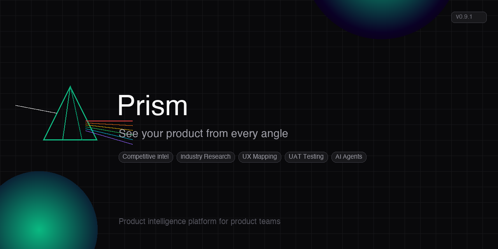

<p align="center">
  
</p>

<p align="center">
  <strong>Product intelligence platform for product teams</strong>
  <br />
  <em>Track competitors, research your industry, map UX flows, run UAT — all in one place</em>
</p>

<p align="center">
  
  
  
  
</p>

---

Prism is a product operating system for PMs. It combines automated UAT testing with autonomous competitive intelligence agents that research your market while you sleep. Drop in your app, describe your product, and Prism discovers competitors, profiles their features and pricing, tracks industry trends, maps UX flows, and generates evidence-backed intelligence reports — all with source URLs.

---

## What It Does

- **Autonomous competitive intelligence** — AI agents discover competitors, research their features, pricing, recent launches, and strategic moves. Each finding is evidence-backed with source URLs.
- **Industry research** — Tracks industry trends, regulatory changes, market data from analyst publications (Skift, PhocusWire, CAPA, etc.). Self-identifies the best sources for your industry.
- **UX flow mapping** — Navigates Android apps via vision-guided automation, maps every screen and flow, compares UX patterns across competitors.
- **Natural language queries** — Ask "How does our booking flow compare to Booking.com?" and get a synthesized answer drawing from all agent knowledge.
- **Vision-guided UAT** — Drop in an APK, point at your Figma file, get a per-frame comparison report. No manual tapping.
- **Multi-planner test suite** — 5 test plan types: feature flow, design fidelity, functional flow, deeplink utility, edge cases.
- **Telegram-first** — Create products, run agents, query knowledge, get daily digests — all from your phone via `/new` and `/intel` commands.
- **Self-healing execution** — Detects crashes, navigation stuck, wrong screens; auto-recovers with per-state playbooks.

---

## Architecture

```
┌────────────────────────────────────────────────────────────────┐
│                      PM INTERFACES                             │
│  Web Dashboard (Prism)  ·  Telegram Bot  ·  Query Engine       │
└──────────────┬─────────────────────────────────────────────────┘
               │
┌──────────────▼─────────────────────────────────────────────────┐
│               AGENT ORCHESTRATOR                               │
│  Schedules sessions · Device lock · Token budget               │
└──┬───────────────┬───────────────┬───────────────┬─────────────┘
   │               │               │               │
┌──▼────────┐ ┌───▼────────┐ ┌───▼──────────┐ ┌──▼───────────┐
│Competitive│ │ Industry   │ │ UX           │ │ UAT Runner   │
│Intel Agent│ │ Research   │ │ Intelligence │ │ (Figma+APK)  │
│  9 tools  │ │  7 tools   │ │  11 tools    │ │ VisionNav    │
└──┬────────┘ └───┬────────┘ └───┬──────────┘ └──┬───────────┘
   │               │               │               │
┌──▼───────────────▼───────────────▼───────────────▼─────────────┐
│                SHARED KNOWLEDGE LAYER                           │
│  Entities · Relations · Observations · Artifacts · Screenshots │
│  SQLite via SQLAlchemy · 17 tables · Semantic search           │
└────────────────────────────────────────────────────────────────┘
```

---

## Project Structure

```
agent/                          # Autonomous agents
  base_autonomous_agent.py      # Base class: work queue + tool-use loop
  intel_agent.py                # Compound competitive_intel + industry_research
  competitive_intel_agent.py    # Competitor discovery and profiling
  industry_research_agent.py    # Industry trends and market data
  impact_analysis_agent.py      # 2nd/3rd-order effects of trends on competitors
  quality_review_agent.py       # Grounding gate — flags unsourced claims
  digest_runner.py              # Daily Telegram digest push
  ux_intel_agent.py             # App UI capture (disabled post-Loupe carve; v0.10.1 work)
  product_os_orchestrator.py    # Agent scheduler and coordinator
  query_engine.py               # NL query → synthesized answer
  knowledge_store.py            # Knowledge graph CRUD interface
  efficient_researcher.py       # Deterministic search + Groq synthesis
tools/                          # Deterministic execution layer
  web_research.py               # Web search + content extraction
utils/                          # LLM clients + cost tracking
  claude_client.py              # Anthropic SDK wrapper
  gemini_client.py              # Google Gemini (fallback)
  groq_client.py                # Groq Llama 3.3 (primary synthesis)
  cost_tracker.py               # Per-call ledger + quota alerts
webapp/
  api/                          # FastAPI backend
    models.py                   # Knowledge graph + work tables
    routes/                     # REST endpoints (projects, knowledge, product-os, cost, digest)
    services/                   # Screen analysis, test planners
  web/                          # Next.js 14 frontend
    app/
      page.tsx                  # Home — product list
      projects/new/             # Create product + auto-start agents
      projects/[id]/            # Tabbed project hub
        page.tsx                # Overview + product timeline
        intelligence/           # Agent controls + status
        uat/                    # Screens, plans, runs, Figma
        competitors/            # Competitor grid + detail
        ask/                    # NL query interface
        backlog/                # Work queue viewer
telegram_bot/bot.py             # Telegram interface (/new, /intel, /run)
config/settings.yaml            # Agent configuration
memory/                         # Compounding intelligence logs
```

---

## Setup

```bash
# 1. Clone and install
git clone https://github.com/yash7agarwal/prism.git
cd prism
python3 -m venv .venv && source .venv/bin/activate
pip install -r requirements.txt
cd webapp/web && npm install && cd ../..

# 2. Configure
cp .env.example .env
# Edit .env: ANTHROPIC_API_KEY (required), TELEGRAM_BOT_TOKEN, GEMINI_API_KEY

# 3. Run backend
.venv/bin/python3 -m uvicorn webapp.api.main:app --reload --port 8000

# 4. Run frontend (separate terminal)
cd webapp/web && npm run dev

# 5. Run Telegram bot (separate terminal)
.venv/bin/python3 -m telegram_bot.run_bot
```

---

## Usage

| Action | Web | Telegram |
|--------|-----|----------|
| Create product | `/projects/new` | `/new Name — description` |
| Run competitive intel | Intelligence tab → Run | `/intel run competitive_intel` |
| View competitors | Competitors tab | `/intel competitors` |
| Ask a question | Ask tab | `/intel ask <question>` |
| Get daily digest | — | `/intel digest` |
| Check agent status | Intelligence tab | `/intel status` |
| Run UAT | UAT tab | `/run <feature>` |
| Upload APK | UAT tab | Send .apk file |

---

## Configuration

| Variable | Description | Required |
|----------|-------------|----------|
| `ANTHROPIC_API_KEY` | Claude API key for agents and vision | Yes |
| `TELEGRAM_BOT_TOKEN` | Telegram bot token | For Telegram |
| `GEMINI_API_KEY` | Google Gemini API key (free tier fallback) | No |
| `TAVILY_API_KEY` | Tavily web search API | No (falls back to DuckDuckGo) |
| `BRAVE_API_KEY` | Brave search API | No |
| `FIGMA_ACCESS_TOKEN` | Figma API token for design imports | For UAT |
| `NEXT_PUBLIC_API_URL` | Backend URL for Vercel deployment | For deploy |

---

## Changelog

### [0.8.0] — 2026-04-18
- Multi-agent Product OS: 3 autonomous agents + shared knowledge graph + query engine
- Rebranded "AppUAT" to "Prism" — generic product intelligence platform
- Unified tabbed project hub with Overview, Intelligence, UAT, Competitors, Ask, Backlog
- Product Timeline with color-coded findings, source links, data freshness
- Telegram `/new` and `/intel` commands for phone-first workflow

### [0.7.1] — 2026-04-12
- Fixed vision navigator truncation, stuck recovery, throttle

### [0.7.0] — 2026-04-12
- Proactive Figma importer — one fetch, zero API calls on subsequent runs

### [0.6.0] — 2026-04-11
- APK-driven E2E UAT execution + multi-planner suite (5 plan types)

### [0.5.0] — 2026-04-10
- Vision-guided UAT + AppUAT web app + Telegram screenshot capture

---

## Roadmap

- [ ] Vercel + Railway deployment (frontend + backend)
- [ ] Real vector embeddings for semantic knowledge search
- [ ] UX flow stitching — combine screenshots into visual journey images
- [ ] Automated daily digest via Telegram (scheduled cron)
- [ ] Feature comparison matrices across competitors
- [ ] Analytics agent — correlate product metrics with competitive moves
